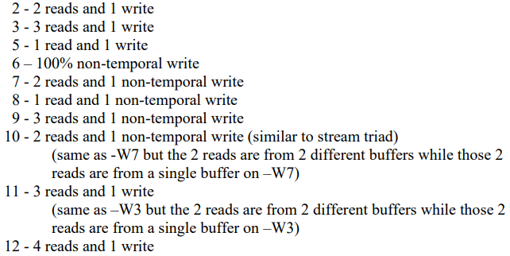
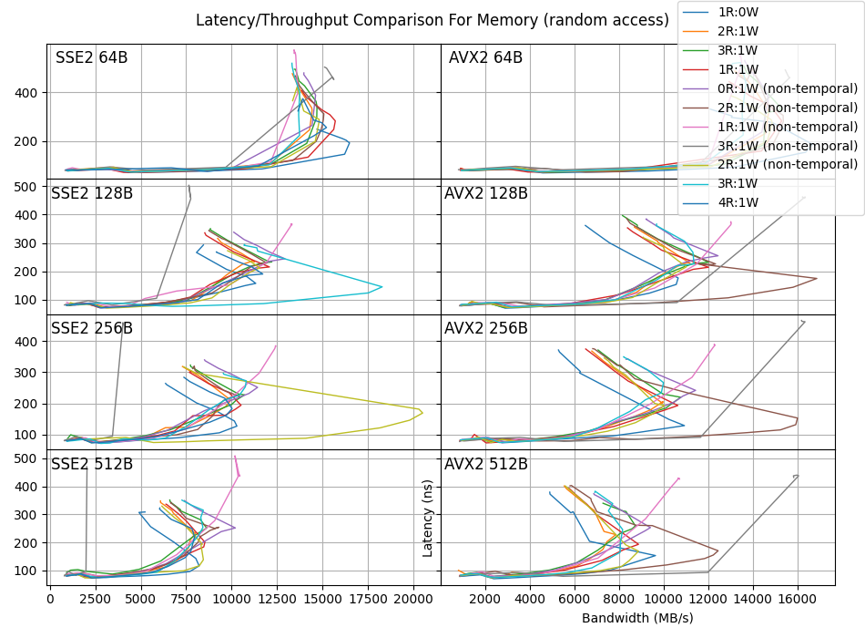
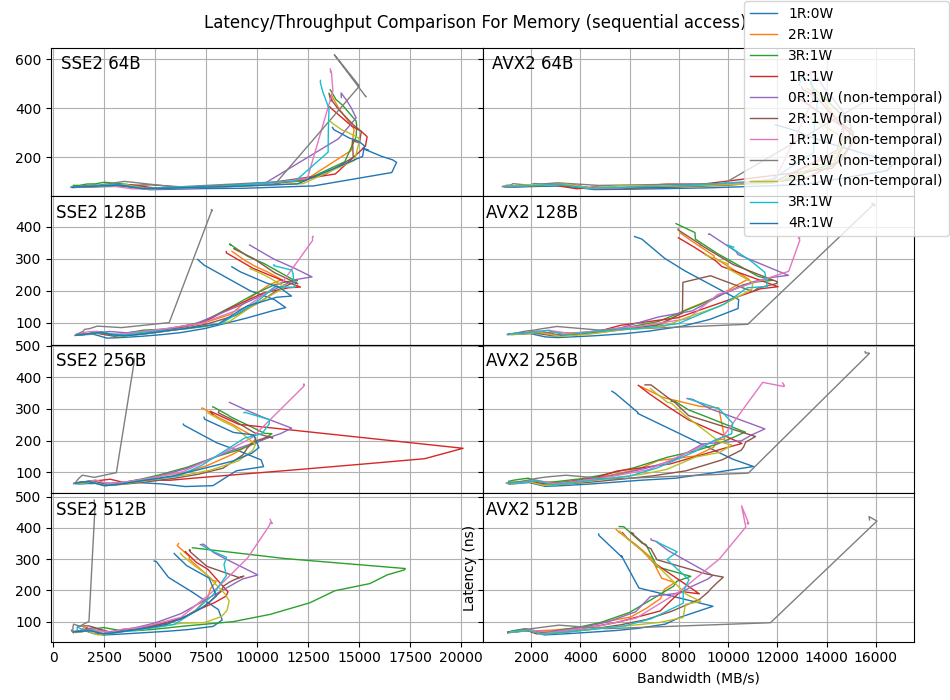

# Data Profiling


## Introduction

Any time spent idle lowers efficiency. Any time spent with tasks in the background increases latency. Therefore bandwidth and latency are inversely correlated. This is especially true whe considering memory and storage access in modern computing. The following was proved experimentally using [Intel's Memory Latency Checker](https://www.intel.com/content/www/us/en/developer/articles/tool/intelr-memory-latency-checker.html). 


## Procedure

Intel's MLC was run as the only program on the computer overnight with a variety of command variations. These command variations tested all of the ratios found in the below figure for sequential and random accesses, SSE2 and AVX2 enabled instructions, and various data access sizes. 

*MLC Ratio Options*


The same procedure can be repeated with fio for SSDs, but carries the risk of bricking the drive if done incorrectly.


## Results

*Random memory accesss*


*Sequential memory accesss*


## Conclusion

There are several unusual readings in the data. It is difficult to tell whether they are due to noise or other characteristics of the computer. Running the tests many times over to average out the results would show this in the future.

Out of the things we can note is that there is no drastic difference between random or sequentiall accesses, nor is there one depending on whether SSE2 or AVX2 is enabled. It appears that for memory these are effectively the same. What is consistent amongst them is that as bandwidth increases latency slowly increases, until a certain point where it drastically jumps. This point seems to be related to memory access size primarily and lies at ~15K MB/s at 64B, ~12.5K MB/s at 128B, ~11K MB/s at 256B, and ~10K MB/s at 512B. This is probably due to the fact that as each  individual operation increases in size the amount of possible operations per second, i.e. optimal bandwidth, decreases.

## Hardware Info

### Windows `Get-ComputerInfo` Dump

```
BiosCharacteristics                                     : {7, 9, 11, 12...}
BiosFirmwareType                                        : Uefi
BiosManufacturer                                        : LENOVO
BiosName                                                : N22ET72W (1.49 )
CsManufacturer                                          : LENOVO
CsNetworkAdapters                                       : {Ethernet 2, vEthernet (Default Switch), Ethernet, Wi-Fi...}
CsNetworkServerModeEnabled                              : True
CsNumberOfLogicalProcessors                             : 8
CsNumberOfProcessors                                    : 1
CsProcessors                                            : {Intel(R) Core(TM) i7-8550U CPU @ 1.80GHz}
CsRoles                                                 : {LM_Workstation, LM_Server, NT}
CsStatus                                                : OK
CsSystemFamily                                          : ThinkPad T480s
CsSystemType                                            : x64-based PC
CsTotalPhysicalMemory                                   : 8480333824
CsPhyicallyInstalledMemory                              : 8388608
CsWakeUpType                                            : PowerSwitch
CsWorkgroup                                             : WORKGROUP
OsType                                                  : WINNT
OsVersion                                               : 10.0.19043
OsBuildType                                             : Multiprocessor Free
OsCodeSet                                               : 1252
OsForegroundApplicationBoost                            : Maximum
OsTotalVisibleMemorySize                                : 8281576
OsFreePhysicalMemory                                    : 969924
OsTotalVirtualMemorySize                                : 21079540
OsFreeVirtualMemory                                     : 2920824
OsInUseVirtualMemory                                    : 18158716
OsTotalSwapSpaceSize                                    :
OsSizeStoredInPagingFiles                               : 12797964
OsFreeSpaceInPagingFiles                                : 9408100
OsMaxNumberOfProcesses                                  : 4294967295
OsMaxProcessMemorySize                                  : 137438953344
OsArchitecture                                          : 64-bit
```