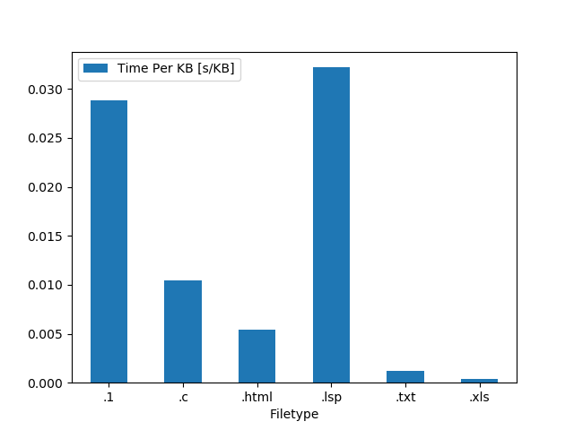
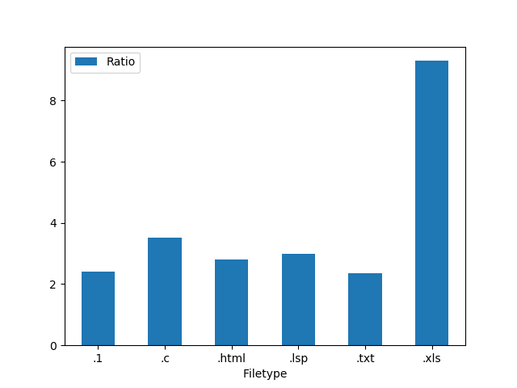

# Multithread Compression Susing ZSTD Library

## Introduction

Compressing objects is a slow, but largely parallelizable operation. By sacrificing possible optimal compression, individual chunks can be compressed at near optimal ratios in parallel. This means that by separating the reading, compression, and writing into separate threads compression speed can be significantly improved.

## Installation

This project presumes you have zstd* already installed. If this is not true you can install it by running:

```sudo apt update && sudo apt install zstd```

After this the code can be downloaded by cloning the repository or downloading it through the github desktop GUI as a zip and then extracting it. Navigate to the folder in which this README is present and compile the code with:

```g++ -std=c++11 -Wall -g *.cpp -o ./main.o -lzstd -pthread```

The code can then be run with the following command:

```./main.o <INPUT_FILE> [<OUTPUT_FILE> <# THREADS>]```

The output file and desired number of threads are optional arguments. Either can appear, and will be autodetected based on whether the argument is an integer. If both appear they must appear in order.

\* ZSTD version 1.4.4 was used, but is not required to be that version.


## Design Choices

*   A common choice for parallel program tasks is a queue because it is quick to access, easy to make threadsafe, and has variable length. Thus, although reading the file could be parallelized as the file is contiguous memory and the size of each contiguous chunk is known, reading the file was done serially. Furthermore, reading the file was not the bottlenex in compression thus making that part faster would deliver marginal benefits if any. In fact, parallelizing reads may hurt performance as the non-sequential aspect of multithreading may harm any locality advantages given from reading contiguous data sequentially. Finally, reading is a largely IO process with minimal CPU usage, thus parallelizing it would not improve CPU usage much.
*   For similar performance reasons, writing to memory is also done serially.
*   Although both reading and writing are done serially, they are done serially in parallel. Or technically, concurrently. A common strategy to improve performance when working with IO streams is to have a separate thread receive frames/blocks/chunks and put them in a queue so the slower processing can happen without losing frames/blocks/chunks of data. This is commonly seen in sensor applications and is why reading and writing were set to run concurrently.
*   A thread-safe queue was implemented to store the tasks to be completed by parallel processes as the tasks can be performed in any order. Mutex locks on the read (pop-front) and writes (push-back) add overhead, but protect the data.
*   Although blocks can be read and compressed in any order, they must be written in the same order the uncompressed blocks exist in the original file. Thus a queue was not ideal for storing the compressed blocks as it does not store the block order. Sorting could be done to ensure the blocks are ordered, but that would lead to even more overhead than a thread-safe queue already has. So instead a vector was used.

    The value in the vector is found in its ordered positions. Each block can only write to the vector position it falls in after modulus arithmetic `(block_id % vector_size)`. The vector size in this case was chosen to be *16 * the number of threads*. This means that each thread can perform 16 compression operations before filling the vector. Divvying memory locations ensures that no two threads attempt to write to the same memory location.

    Various other rules are implemented to ensure it is thread-safe. Namely, a vector cannot write to a space that is already full. A location is not emptied until that data has been written to storage by the writer thread. The writer thread starts with a pointer to the first element in the vector and, once it sees it has data, writes that data to storage, erases the element data, and increases the pointer to point to the second element. Then it waits until the second element has data. Thus the writer can write data continuously as long as the data itself is continuous. If one thread is slower at compressing its data the other threads have 15 tasks left as a buffer before the vector is full. Once the vecotor is full all threads must wait until the writer has freed up space.

    There is a risk for collisions. This risk happens when the reader queues up blocks farther than *16 * the number of threads* blocks ahead of the current **next block to be written**. At this point there is an overlap in the modulus arithmetic and it is possible for two threads to pick data for the same block. This can cause a race condition.

    Example:
    8 threads are used. Compressing block #7 is slow. Block #135 is read and queued as a task. Before block #7 can be written to the empty space in the vector at position 7, block #135 is compressed and written there instead. This means that block #7 cannot write to the vector until position 7 is freed, but position 7 will never be freed until blocks #7-135 are written to storage. Considering this relies on the other threads being 16x faster than any given thread, the chances of this ocurring are relatively low. If reading was done in parallel and not sequentially this would be a more significant issue.


## Testing

Testing was performed by compressing the Canterbury Corpus, a benchmark for compression methods <https://corpus.canterbury.ac.nz/index.html>. Correctness was tested manually by compressing the file with the written code and uncompressing the file using [unzstd](https://www.manpagez.com/man/1/unzstd/). The uncompressed file was then compared to the original using the Linux [diff](https://man7.org/linux/man-pages/man1/diff.1.html) command to ensure correct compression, e.g. no differences found. The automated performance testing for data anlytics was performed with the included [test.py](test.py) file. In this program each file in the Canterbury Corpus was compressed 20 times, each time being timed and recorded. This is repeated for every integer number of threads between 2 and 16. The data is all saved to a csv for further analytics. The graphs included were generated by taking the average of the data in the [graph.py](graph.py) file.

## Summary

The optimal thread ratio seemed to be either 5 or 7 threads. This seems an odd value until one considers that separate threads are created for reading and writing, in addition to the main process thread. This means that at '5' threads there are in actuality 8 running, which concurrs neatly with the 8 logical cores on the testing hardware. This is likely the reson for the performance boost at that number. Testing on machines with different amount of cores would be necessary to prove this. At '7' threads there are a total of 10 running threads, but the performance boost here is likely due to the limit of performance obtained just in compression threads. That is to say, after 7 compression threads the overhead in managing them and distributing tasks is likely larger than the benefit obtained by parallelizing.


Furthermore, it seems that performance is also closely tied to filetype, as well as thread count. On highly compressible files, such as XLS files, the compression happens both faster and at a more optimal ratio. This is not a hard rule however, as text has the second highest performance, but the worst compression ratio. The worst being slightly over 2, which matches with ZSTD's promise of a ~2.44 ratio.





Note: Interestingly, race conditions happened much less frequently when debugging, which made debugging much more difficult. This is likely because the slight overhead caused by gdb prevented certain conditions from ocurring.

## Future Steps

At some point the compression will be parallelized enough that the bottlenecks will lie in other areas. The reads can be serialized relatively trivially as it mostly consists of moving pointers by known, fixed amounts. The writes can be parallelized if necessary by writing sequential super-blocks in parallel to temporary locations, and then writing those sequentially once they're ordered.

Smaller optimizations can be performed if the hardware is known by editing the block size, vector size, and thread count to leverage the number of cores on the CPU as well as its cache.

## Hardware Details

### Windows `Get-ComputerInfo` Dump

```
BiosCharacteristics                                     : {7, 9, 11, 12...}
BiosFirmwareType                                        : Uefi
BiosManufacturer                                        : LENOVO
BiosName                                                : N22ET72W (1.49 )
CsManufacturer                                          : LENOVO
CsNetworkAdapters                                       : {Ethernet 2, vEthernet (Default Switch), Ethernet, Wi-Fi...}
CsNetworkServerModeEnabled                              : True
CsNumberOfLogicalProcessors                             : 8
CsNumberOfProcessors                                    : 1
CsProcessors                                            : {Intel(R) Core(TM) i7-8550U CPU @ 1.80GHz}
CsRoles                                                 : {LM_Workstation, LM_Server, NT}
CsStatus                                                : OK
CsSystemFamily                                          : ThinkPad T480s
CsSystemType                                            : x64-based PC
CsTotalPhysicalMemory                                   : 8480333824
CsPhyicallyInstalledMemory                              : 8388608
CsWakeUpType                                            : PowerSwitch
CsWorkgroup                                             : WORKGROUP
OsType                                                  : WINNT
OsVersion                                               : 10.0.19043
OsBuildType                                             : Multiprocessor Free
OsCodeSet                                               : 1252
OsForegroundApplicationBoost                            : Maximum
OsTotalVisibleMemorySize                                : 8281576
OsFreePhysicalMemory                                    : 969924
OsTotalVirtualMemorySize                                : 21079540
OsFreeVirtualMemory                                     : 2920824
OsInUseVirtualMemory                                    : 18158716
OsTotalSwapSpaceSize                                    :
OsSizeStoredInPagingFiles                               : 12797964
OsFreeSpaceInPagingFiles                                : 9408100
OsMaxNumberOfProcesses                                  : 4294967295
OsMaxProcessMemorySize                                  : 137438953344
OsArchitecture                                          : 64-bit
```